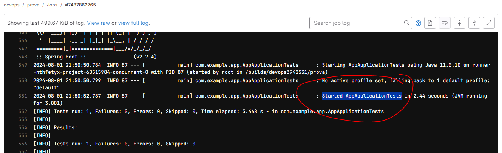
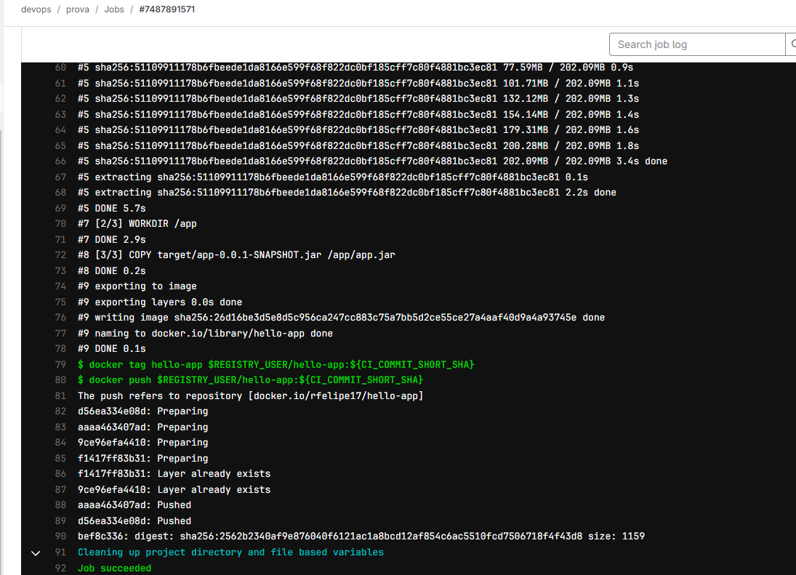
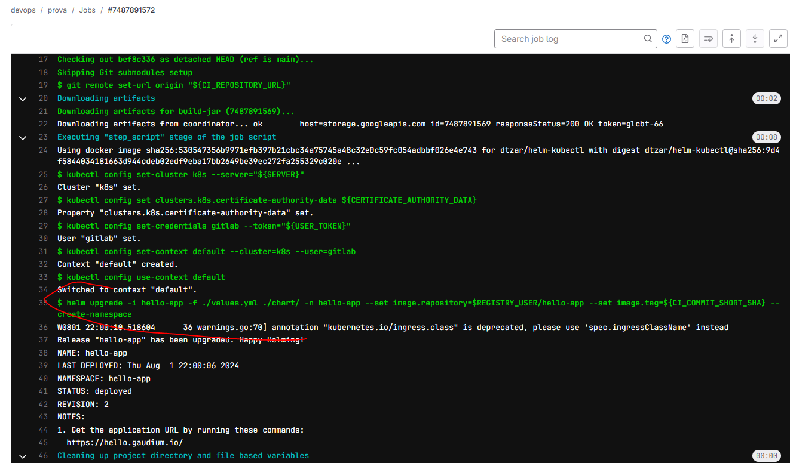

1. Criação da infraestrutura com cluster EKS usando CloudShell e eksctl:
eksctl create cluster --name gaudium-cluster-01 --version 1.30 --region ap-southeast-2 --node-type t4g.small --nodes 2 --nodes-min 1 --nodes-max 4 --nodegroup-name apps

Justificativa técnica: embora iniciamos com apenas uma aplicação, o uso de K8s permite escalar o ambiente no curto, médio e longo prazo, comportando mais workloads sem a necessidade de migração posterior em decorrência do uso de vários ECS, etc.

2. Deploy do Ingress Controller para implementar single entry point para as aplicações do cluster:
helm --install ingress-nginx ingress-nginx --repo https://kubernetes.github.io/ingress-nginx --namespace ingress-nginx --create-namespace

Justificativa técnica: uma vez usando K8s, importante usar um ingress gateway para proporcionar segurança e controlar o tráfego para os workloads. Istio pode ser usado para proporcionar, além de controler de ingress, egress, resiliência com circuit braker e fallback method, timeouts, etc. via sidecar.

3. Criação do token para integração na pipeline CI/CD:
kubectl create serviceaccount gitlab

cat <<EOF | kubectl create -f -
apiVersion: rbac.authorization.k8s.io/v1
kind: ClusterRoleBinding
metadata:
  name: gitlab-integration
  labels:
    k8s-app: gitlab-image-builder
roleRef:
  apiGroup: rbac.authorization.k8s.io
  kind: ClusterRole
  name: cluster-admin
subjects:
- kind: ServiceAccount
  name: gitlab
  namespace: default
EOF

kubectl get secret $(kubectl get serviceaccount gitlab -o jsonpath='{.secrets[0].name}') -o jsonpath='{.data.token}' | base64 --decode
kubectl get secrets gitlab -o jsonpath='{.data.token}' | base64 -d
kubectl create token gitlab --duration=999999h

Justificativa técnica: para dar bypass em qualquer problema de permissão via IAM, fui direto na criação clássica de token para integração. IAM é melhor para evitar long-lived tokens/passwds, etc. Também é possível (e desejável?) um serviço de token e secrets centralizado, como o Hashicorp Vault.

4. CI/CD com Gitlab:
Principais stages:
- Testes unitários:

- Build e push da docker image:

- Deploy com Helm chart:

Justificativa técnica: para evitar vendor lock-in, o ideal é ter uma ferramenta de CI/CD cloud agnóstica, que possa ser apontada para outro cloud provider em caso de migração ou multi-cloud. Além do mais, são ferramentas mais versáteis quanto a templetização e consumo por projetos, favorecendo a criação de pipelines mais complexas e reutilizáveis. O uso de Helm charts promove reusabilidade, padronização e self-service para deploy de workloads.

5. Validação:
Infelizmente as pods crasharam e não deu tempo para fazer troubleshooting.
Também não consegui tempo para apontar para o ECR, acabou ficando no docker hub.

curl --resolve hello.gaudium.io:80:52.63.238.182 http://hello.gaudium.io
